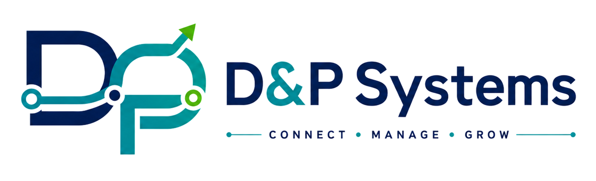

  

# D & P Systems Portfolio

**Business systems developer turning real workflows into modern Supabase-backed applications with data isolation, operational usability, and mobile-tested behavior.**

This portfolio presents D & P Systems as a practical software builder for small-business systems: marketplaces, booking tools, queue dashboards, internal admin panels, and lightweight SaaS-style applications built with Supabase, PostgreSQL, Row Level Security, vanilla JavaScript, GitHub, Vercel, and real-device mobile QA. It is intentionally positioned around business workflow thinking first, with modern implementation as the proof.

The positioning is simple:

> Earlier systems-analysis experience, modern Supabase implementation, and working proof through real portfolio projects.

## Live Site

[View Portfolio](YOUR_VERCEL_LINK)

## First 15-Second Message

This portfolio is designed to communicate quickly:

- I build **business systems**, not just static websites.
- I can implement **modern Supabase-backed workflows** with Auth, PostgreSQL, RLS, and RPC logic.
- I understand **business operations**: records, ownership, status changes, permissions, queues, appointments, stock, orders, and customer follow-up.
- I test beyond desktop layout, including **real mobile behavior**, Android Back, keyboard issues, sticky navigation, and form safety.
- My current proof is shown through two flagship builds: **Marketplace** and **QueuePoint**.

## Featured SaaS Projects

### 1. Multi-Seller Marketplace Prototype

A working Supabase-backed marketplace prototype focused on buyer, seller, checkout, and order workflows.

Key features:

- Buyer storefront and cart
- Guest checkout
- Multi-seller order splitting
- Seller dashboard
- Product CRUD
- Stock validation
- Order tracking
- Review submission and moderation
- Supabase Auth
- PostgreSQL RPC checkout flow
- Row Level Security
- Real Android mobile QA
- Chrome DevTools remote debugging

**What it proves:** e-commerce workflow depth, seller identity handling, checkout safety, product/order ownership, and mobile-tested buyer/seller flows.

[View Marketplace Case Study](marketplace-case-study.html)

### 2. QueuePoint Appointment & Queue SaaS MVP

A multi-branch appointment and queue management SaaS MVP for small service businesses.

Key features:

- Public appointment booking
- Public business/location picker
- Customer appointment tracking
- Short appointment codes
- Authenticated business dashboard
- Business / branch management
- Public location picker
- Branch-specific services
- Branch-specific staff records
- Branch-specific booking settings
- Appointment status updates
- Queue board
- Supabase Auth
- PostgreSQL tables
- Row Level Security policies
- Public/private data separation
- Global edit-lock UX protection
- Android Back trapping during edit mode
- Mobile sticky dashboard navigation
- Booking draft protection against accidental navigation
- Android Back trapping during public booking drafts
- Landscape focused-field dock for mobile keyboard usability

**What it proves:** SaaS-style branch isolation, multi-tenant thinking, public/private workflow separation, mobile usability hardening, and pilot-ready appointment/queue operations.

[View QueuePoint Case Study](queuepoint-case-study.html)

## Technical Stack

Core stack:

- HTML
- CSS
- Vanilla JavaScript
- ES Modules
- Supabase
- PostgreSQL
- Row Level Security
- Supabase Auth
- Supabase RPC functions
- GitHub
- Vercel

Testing and workflow:

- Chrome DevTools
- Real Android phone testing
- Mobile portrait and landscape QA
- Android Back behavior testing
- Keyboard and form usability testing
- Console debugging
- Deployment checks

## What This Portfolio Is Meant to Prove

This portfolio is not mainly about visual design. It is designed to prove that D & P Systems can build working business workflows.

### Business workflow thinking

The projects show how manual processes become structured software:

- products become database records
- sellers and businesses own their own data
- appointments and orders move through statuses
- dashboards expose daily operating tasks
- public users see only what they should see
- authenticated users manage protected records
- mobile users can complete real tasks without losing data

### Supabase implementation ability

The projects show practical Supabase use:

- Authenticated dashboards
- Public booking/tracking flows
- Row Level Security policies
- Role-based access
- PostgreSQL relationships
- RPC-style backend workflows
- Branch-specific data
- Tenant isolation
- Deployment-ready environment setup

### Mobile usability hardening

The projects document real mobile issues that were tested and fixed:

- sticky dashboard navigation
- Android Back behavior
- edit-lock protection
- booking draft protection
- landscape keyboard pressure and focused-field docking
- native date picker behavior
- mobile form usability
- status badge readability
- branch/location switching
- real-device QA beyond desktop resizing

## Main Portfolio Sections

- Background
- Services
- Featured SaaS Projects
- Marketplace Case Study
- QueuePoint Case Study
- Database Proof
- Real-Device QA
- Client Fixes
- Contact

## QueuePoint MVP Status

QueuePoint is intended to reach:

> **QueuePoint v1 MVP — portfolio-ready and small guided-pilot ready.**

Completed / near-complete:

- Business / Branch MVP
- Services MVP
- Staff MVP
- Settings MVP
- Public booking
- Public location picker
- Booking draft protection
- Appointment tracking
- Appointments dashboard
- Queue dashboard
- Auth/session guard
- Branch selector
- Supabase RLS and grants cleanup
- Global edit-lock protection
- Back-button protection during edit mode
- Mobile sticky dashboard navigation
- Mobile appointment badge polish
- Login mobile polish
- Track result focus behavior
- Refresh feedback
- Public booking location picker
- Public booking Back/draft protection
- Landscape focused-field dock

Remaining before final portfolio lock:

- final real-phone regression
- SQL cleanup
- CSS cleanup
- final screenshots
- QueuePoint case study screenshot insertion
- README and deployment finalization

Future Phase 2 / Pilot Feedback features:

- staff login accounts
- service-to-staff assignment UI
- public staff availability picker
- staff schedule availability checks
- database validation for staff work days
- GCash/Maya deposit or QR workflow
- SMS/Viber reminders
- owner subscription controls
- admin/pilot management console

## Positioning

The portfolio should avoid sounding like a developer merely "returning" or "catching up."

Preferred positioning:

> Business systems developer with earlier systems-analysis experience and modern Supabase full-stack implementation skills.

Supporting message:

> I bring earlier business-software experience into modern web development, building practical SaaS-style applications with Supabase, PostgreSQL, RLS, RPC workflows, Vercel deployment, and mobile-tested user flows.

## Project Narrative

The two flagship projects tell a stronger story together:

- **Marketplace** proves e-commerce workflow logic: products, sellers, carts, checkout, orders, stock, reviews, and mobile buyer/seller flows.
- **QueuePoint** proves SaaS workflow logic: businesses, branches, services, staff, settings, appointments, queues, public booking, tracking, and multi-tenant access control.

Together, they position D & P Systems for:

- custom business systems
- appointment and queue tools
- seller dashboards
- internal admin panels
- lightweight SaaS prototypes
- Supabase-backed operational software
- small-business workflow automation

## Notes for Portfolio Finalization

Before final publishing:

1. Insert final QueuePoint screenshots.
2. Update live demo links.
3. Replace placeholder image notes.
4. Confirm Marketplace and QueuePoint case-study links.
5. Confirm mobile layout on real phone.
6. Confirm no outdated QueuePoint status claims remain.
7. Confirm README matches the final deployed homepage.
8. Confirm GitHub and Vercel links are correct.

## Debugging / QA Lessons Captured

These lessons can be reused in the future mobile-porting position paper:

- **Before pasting code, press Esc.**
- **Before blaming Supabase, check the session.**
- **Before blaming scroll, check `display: none`.**
- **Before trusting mobile, beware the Back Button.**
- **Responsive layout makes the app fit. Responsive interaction makes the app usable.**

Working joke / field note:

> Hadō #47: Escape Before Paste — prevents hidden VS Code multi-cursors from duplicating code into forbidden dimensions.

## Status

This README is a stronger positioning draft for the updated portfolio that includes both Marketplace and QueuePoint.

It is meant to support a sharper first impression:

> D & P Systems builds practical Supabase-backed business systems with real workflow logic, data isolation, and mobile-tested usability.
